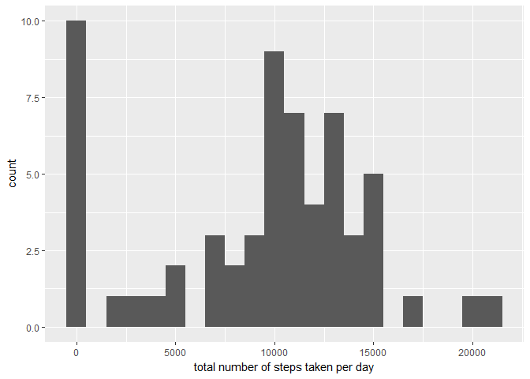
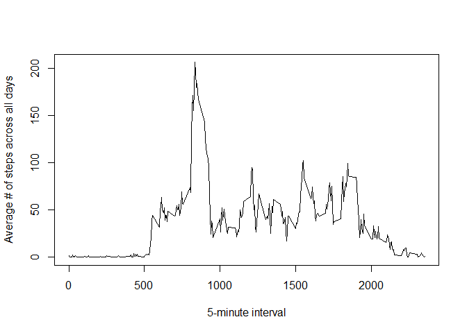
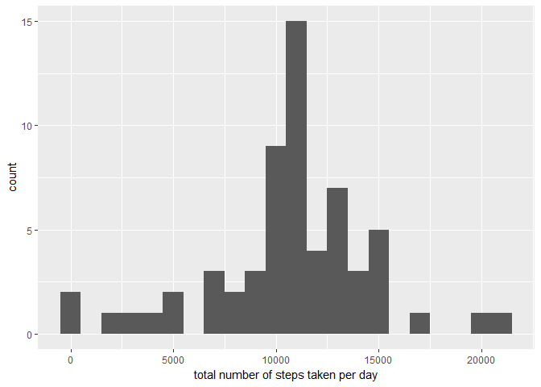
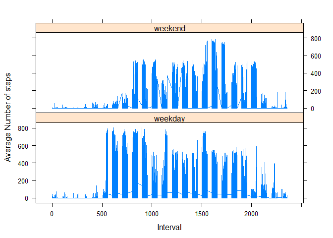

Loading and preprocessing the data
----------------------------------

``` r
## first download the data if not present
if (!file.exists("activity.zip")) {
    url <- "https://github.com/ostaski/RepData_PeerAssessment1/raw/master/activity.zip"
    destFile <- "./activity.zip"
    download.file(url, destFile)

    unzip(zipfile="./activity.zip")

    fileConn <- file("dateActivityDownloaded.txt")
    writeLines(date(), fileConn)
    close(fileConn)
}

## now load and preprocess the data
activity <- read.csv('activity.csv', header = TRUE, sep = ",")

activity$date <- as.Date(activity$date, format = "%Y-%m-%d")
```

What is mean total number of steps taken per day?
-------------------------------------------------

For this part of the assignment, you can ignore the missing values in the dataset.
Calculate the total number of steps taken per day

``` r
stepsPerDay <- tapply(activity$steps, activity$date, FUN = sum, na.rm = TRUE)

## plot stepsPerDay with qplot
library(ggplot2)
qplot(stepsPerDay, binwidth = 1000, xlab = "total number of steps taken per day")
```



Calculate and report the mean and median of the total number of steps taken per day

``` r
mean(stepsPerDay)
```

    ## [1] 9354.23

``` r
median(stepsPerDay)
```

    ## [1] 10395

What is the average daily activity pattern?
-------------------------------------------

Make a time series plot (i.e. type = "l") of the 5-minute interval (x-axis) and the average number of steps taken, averaged across all days (y-axis)

``` r
avgDailyActivityPattern <- tapply(activity$steps, activity$interval, mean, na.rm=TRUE)
plot(names(avgDailyActivityPattern), avgDailyActivityPattern, type="l", xlab="5-minute interval", ylab="Average # of steps across all days")
```



Which 5-minute interval, on average across all the days in the dataset, contains the maximum number of steps?

``` r
avgDailyActivityPattern[which.max(avgDailyActivityPattern)]
```

    ##      835 
    ## 206.1698

The 835 interval contains the maximum number of steps: 206.1698

Imputing missing values
-----------------------

Note that there are a number of days/intervals where there are missing values (coded as NA). The presence of missing days may introduce bias into some calculations or summaries of the data.
Calculate and report the total number of missing values in the dataset (i.e. the total number of rows with NAs)

``` r
sum(!complete.cases(activity))
```

    ## [1] 2304

Devise a strategy for filling in all of the missing values in the dataset. The strategy does not need to be sophisticated. For example, you could use the mean/median for that day, or the mean for that 5-minute interval, etc.
Create a new dataset that is equal to the original dataset but with the missing data filled in.

``` r
completeActivity <- activity
for (i in which(sapply(completeActivity, is.numeric))) {
    for (j in which(is.na(completeActivity[, i]))) {
        completeActivity[j, i] <- mean(completeActivity[completeActivity[, "interval"] == completeActivity[j, "interval"], i],  na.rm = TRUE)
    }
}
```

Make a histogram of the total number of steps taken each day.

``` r
stepsPerDay1 <- tapply(completeActivity$steps, completeActivity$date, FUN = sum)
qplot(stepsPerDay1, binwidth = 1000, xlab = "total number of steps taken per day")
```



Calculate and report the mean and median total number of steps taken per day.

``` r
mean(stepsPerDay1)
```

    ## [1] 10766.19

``` r
median(stepsPerDay1)
```

    ## [1] 10766.19

Do these values differ from the estimates from the first part of the assignment? What is the impact of imputing missing data on the estimates of the total daily number of steps?
Yes, the values are different from the estimates. The imputed data increased the estimates of the total daily number of steps.

Are there differences in activity patterns between weekdays and weekends?
-------------------------------------------------------------------------

For this part the weekdays() function may be of some help here. Use the dataset with the filled-in missing values for this part.
Create a new factor variable in the dataset with two levels – “weekday” and “weekend” indicating whether a given date is a weekday or weekend day.

``` r
# from https://stackoverflow.com/questions/28893193/creating-factor-variables-weekend-and-weekday-from-date
#create a vector of weekdays
weekdays <- c('Monday', 'Tuesday', 'Wednesday', 'Thursday', 'Friday')
#Use `%in%` and `weekdays` to create a logical vector
completeActivity$wDay <- c('weekend', 'weekday')[(weekdays(completeActivity$date) %in% weekdays)+1L]
```

Make a panel plot containing a time series plot (i.e. type = "l") of the 5-minute interval (x-axis) and the average number of steps taken, averaged across all weekday days or weekend days (y-axis). See the README file in the GitHub repository to see an example of what this plot should look like using simulated data.

``` r
meanComplActivity <- aggregate(completeActivity$steps, 
    by=list(completeActivity$wDay, 
    completeActivity$date, completeActivity$interval), mean)

## rename the column names
names(meanComplActivity) <- c("wDay", "date", "interval", "mean")

## load the lattice library for xyplot
library(lattice)
xyplot(mean ~ interval | wDay, meanComplActivity, 
    type="l", 
    lwd=1, 
    xlab="Interval", 
    ylab="Average Number of steps", 
    layout=c(1,2))
```


